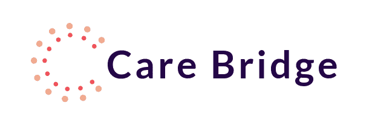
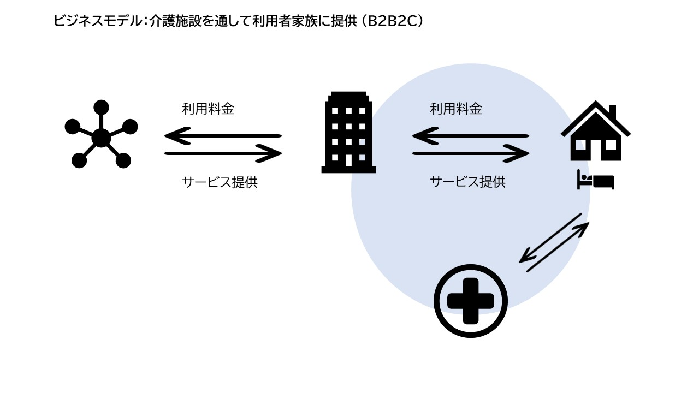
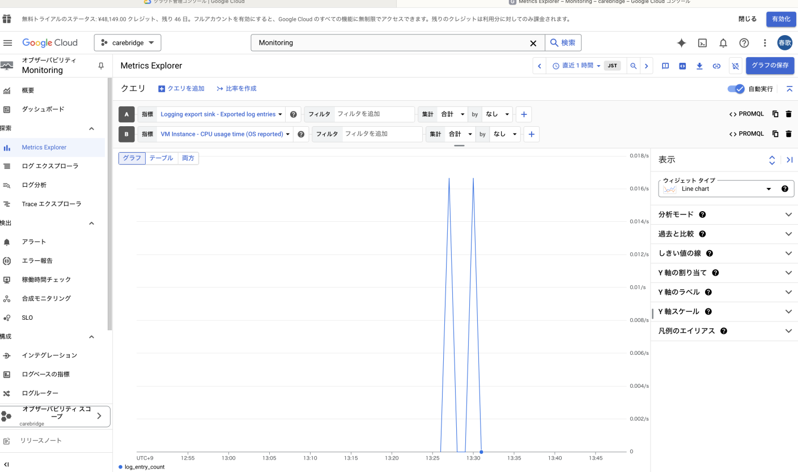
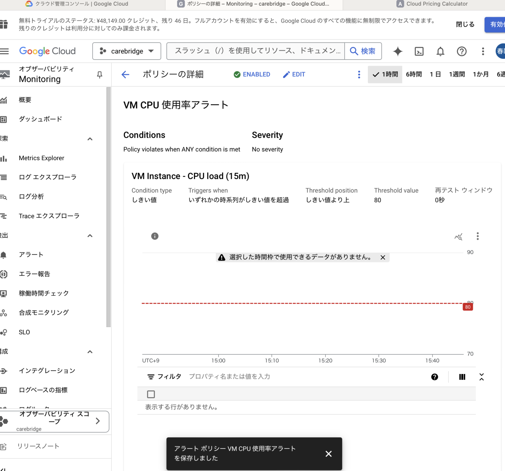
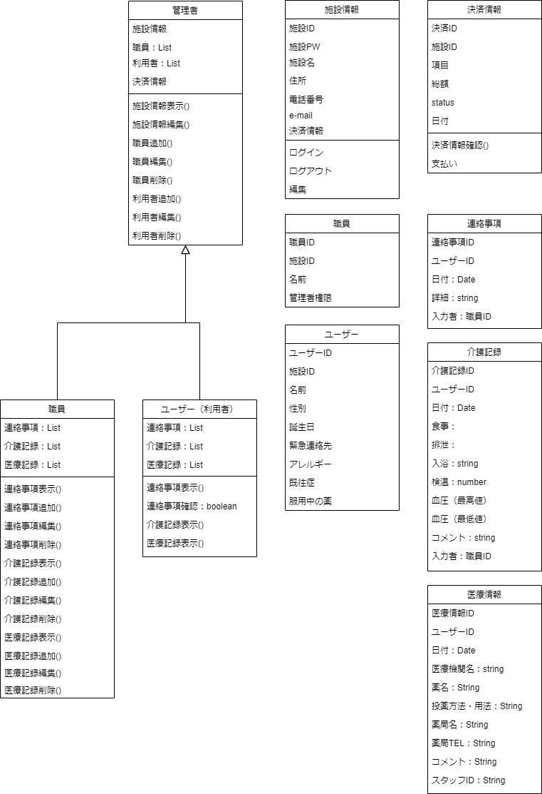
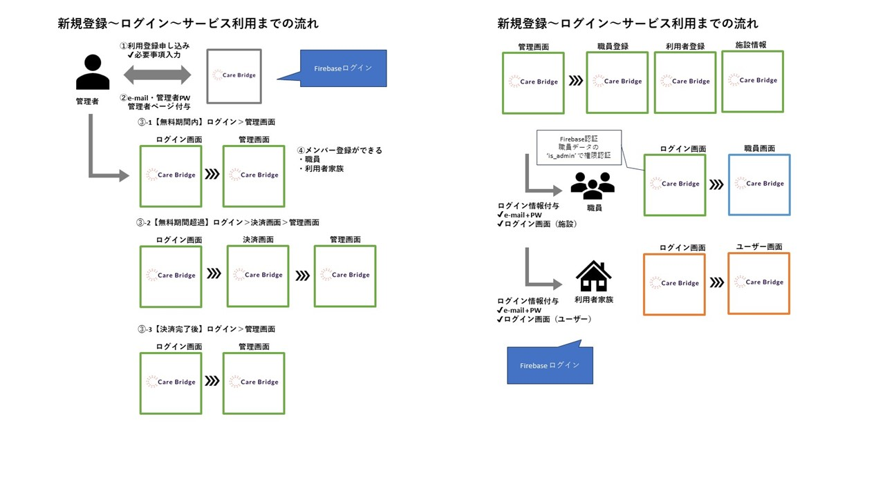

# 設計ドキュメント

### プロダクト全体像

[carebridgeアプリ動画を再生する](https://drive.google.com/file/d/1Vm52IrwQR0o821QlXBSGE9cbGAQgSz7g/view?usp=share_link)

（介護施設職員間、利用者家族の間での情報共有を効率化し、介護職員・利用者家族ともに負担を軽減。コミュニケーションの摩擦軽減）したい
（介護施設職員）向けの、
（CareBridge（ケアブリ））というプロダクトは、
（介護施設情報共有システム）である。
これは、（介護現場における情報の正確性、アクセス性、効率性を向上させること）ができ、
（一般的な情報一元管理サービス）とは違って、
（双方向から情報提供をしやすい機能）が備わっている。

Care Bridge ロゴ

| 項目             | 内容                                                                       |
| ---------------- | -------------------------------------------------------------------------- |
| プロジェクト名   | CareBridge（ケアブリ）                                                     |
| 作成日           | 2024-08-01                                                                 |
| 作成者           | あみ・はるか・ななこ                                                       |
| プロダクトの概要 | 介護施設職員と利用者家族の情報を一括管理し、共有を効率化するためのシステム |

  
ビジネスモデル

### 1. 背景と目的

| 項目               | 内容                                                                                                                 |
| ------------------ | -------------------------------------------------------------------------------------------------------------------- |
| 現状の問題点       | 高齢化が進み介護人材が不足している中、介護施設職員と利用者家族の間での情報共有が手間であり、効率的でない。           |
| 解決したい課題     | 情報共有の手間削減、情報の正確性とアクセスの向上                                                                     |
| ターゲットユーザー | 介護施設職員（利用者家族）                                                                                           |
| プロダクトの目的   | 情報共有を一括管理することで、情報の正確性、アクセス性、効率性を向上させる。双方向から情報提供をしやすいようにする。 |

### 2. 機能要件

  
画面遷移図

| 機能カテゴリ           | サブカテゴリ             | 機能内容                                                             |
| ---------------------- | ------------------------ | -------------------------------------------------------------------- |
| ユーザー管理           | ユーザー登録             | - 介護施設職員および利用者家族のアカウント登録機能                   |
|                        |                          | - 必要情報（名前、メールアドレス、パスワードなど）の入力と保存       |
|                        | ログイン/ログアウト      | - 認証機能（メールアドレスとパスワード）                             |
|                        |                          | - セッション管理                                                     |
| 職員用ダッシュボード   | 連絡事項管理             | - 利用者に関する連絡事項の表示、登録、編集、削除                     |
|                        | 健康状態管理             | - 利用者の健康状態の表示、登録、編集、削除                           |
|                        | 家族からのシェア情報管理 | - 家族からの情報共有（健康情報、連絡先など）の表示、登録、編集、削除 |
| 利用者用ダッシュボード | メンバー登録             | - 家族メンバーの登録、情報の表示、編集、削除                         |
|                        | 連絡事項管理             | - 家族からの連絡事項の表示、登録、編集、削除                         |
|                        | 健康状態管理             | - 家族からの健康情報の表示、登録、編集、削除                         |
|                        | 医療情報管理（ORM）      | - 医療記録の表示、登録、編集、削除                                   |
| 管理者用画面           | 施設情報管理             | - 施設情報の表示と編集                                               |
|                        | 職員登録管理             | - 新規職員の登録、情報の表示、編集、削除                             |
|                        | 利用者登録管理           | - 新規利用者の登録、情報の表示、編集、削除                           |

## 3. 非機能要件

### 運用設計

| 非機能要件分類 | 設計・対策 | 備考 |
| --- | --- | --- |
| ログ管理 | Google Cloud Logging を利用してログをアーカイブし、一定期間保持する設定を行う予定 | Google Cloud Logging で自動的に管理予定 |
| サーバー状態モニタリング ※CPU、メモリ、ディスク使用率を監視 | Google Cloud Monitoring のアラート機能を利用して監視 | Google Cloud Monitoring でアラート設定済み |
| 運用コスト | Google Cloud Billing を使用し、月次で予算確認と費用対策を実施予定 | Google Cloud Pricing Calculator で予測コストも算出可能予定 |
| デプロイフローの明確化 | Docker を使ったコンテナ管理と CI/CD の設定 | 自動デプロイと環境構築を整備中 |

### 性能設計

| 非機能要件分類 | 設計・対策 | 備考 |
| --- | --- | --- |
| 性能要件の定義（レスポンスタイム、スループット） | レスポンスタイムやスループットをGoogle Cloud Monitoringで測定・追跡予定 | カスタムメトリクスを設定し、性能指標をリアルタイムで確認予定 |
| 性能測定の仕組み | Google Cloud Monitoring でアプリケーションのパフォーマンスを測定予定 | レスポンスタイム、CPU使用率、メモリ使用率などのモニタリング予定 |
| キャッシュの設計 | Memcached を導入してキャッシュの設計を実現 | 頻繁にアクセスされるデータをキャッシュし、パフォーマンス向上 |
| 適切なキャッシュ運用 | Memcached のヒット率やメモリ使用状況をGoogle Cloud Monitoringで監視 | キャッシュが適切に機能しているかを継続的に確認 |

### ログ設計

| 非機能要件分類 | 設計・対策 | 備考 |
| --- | --- | --- |
| メモリキャッシュの設定 | 開発環境では LocMemCache、本番環境では Memcached が使用され、リソース管理が可能 | 運用環境でのリソース消費を最小限に抑える対策 |
| ログレベル設定 | 環境変数 DEBUG によって、開発環境と本番環境でログレベルを調整可能 | 開発環境ではデバッグログ、本番環境では INFO 以上のログ |
| データベースログの独立管理 | Django のロギング機能を使用し、DB バックエンドのログをコンソールに出力 | 操作履歴やエラーログのトレースが可能 |
| モニタリングとアラート | Google Cloud Monitoring でリソースの状態を監視し、アラート設定 | 異常時に早期対応が可能 |

### 可用性設計

| 非機能要件分類 | 設計・対策 | 備考 |
| --- | --- | --- |
| サーバー稼働状況のリアルタイム監視 | Google Cloud Monitoringを用いてリアルタイムでサーバーのCPU使用率などのメトリクスを監視し、グラフとしてダッシュボードに表示 | Google Cloud Monitoring で監視設定 |

### セキュリティ

| 非機能要件分類 | 設計・対策 | 備考 |
| --- | --- | --- |
| 認証・認可 | Firebaseによる認証と認可を実装 | Firebase Authenticationを使用 |
| ロール管理 | Firebase Admin SDKを使用してロールごとの権限管理を実装 | 最小権限の原則を適用 |
| クレデンシャル管理 | .envファイルでサービスアカウントキーなどのクレデンシャルを秘匿 | サービスアカウントの管理 |
| パスワード管理 | Firebase Authenticationでパスワードは自動的にハッシュ化されて保存 | Firebase標準のハッシュ化 |
| ユーザーID管理 | Firebaseで生成されるユーザーIDはランダムに生成される | 安全なID管理 |

  
Google Cloud Monitoring

  ### CPU 使用率アラート設定
  

  ### レスポンスタイムの測定
  

### 4. 技術スタック

| 項目                     | 内容                                                                                                                                                                                                                                                                                     |
| ------------------------ | ---------------------------------------------------------------------------------------------------------------------------------------------------------------------------------------------------------------------------------------------------------------------------------------- |
| フロントエンド技術       | React/next.js 　：BC 中使い慣れてるため。世界的にも利用率が高いため。                                                                                                                                                                                                                    |
| バックエンド技術         | Python/Django 　：Python は LLM に適している。（豊富なライブラリ、活発なコミュニティ、簡潔なシンタックス、高度なデータ処理能力、統合環境の提供、そして API との統合が容易であるため）/Django は大規模開発に最適で、迅速な開発、強力な ORM、優れたセキュリティ、そして LLM との統合が容易 |
| データベース             | PostgreSQL：正確なデータ管理、機能の豊富さ、そして高いセキュリティ機能を兼ね備えており、介護施設情報共有システムに適してると考えたから                                                                                                                                                   |
| クラウドプラットフォーム | GCR：Firebase、Cloud Vision API など、Google の他のサービスとシームレスに統合できるため                                                                                                                                                                                                  |
| 認証機能                 | Firebase：コストが抑えられる（無料プランでも多くの機能が使用可能）であることと、BC の学習で使用し使い慣れているため                                                                                                                                                                      |
| 決済機能                 | Stripe                                                                                                                                                                                                                                                                                   |
| OCR                      | Google Vision API：画像生成には複雑なレイアウトや手書き文字の認識においても精度が高いため                                                                                                                                                                                                |

- [技術選定の理由と比較](https://catkin-dracopelta-417.notion.site/dda06d9f4ccc41b1911c4db4b944b34e?pvs=4)

### 5. システムアーキテクチャ

| 項目                 | 内容                                                 |
| -------------------- | ---------------------------------------------------- |
| フロントエンド       | ユーザーインターフェースの設計と実装                 |
| バックエンド         | ビジネスロジック、データ処理、API の設計と実装       |
| データベース         | データモデルの設計と実装                             |
| インフラストラクチャ | サーバー設定、ネットワーク設定、クラウドリソース管理 |
| セキュリティ         | 認証、認可、データ暗号化、アクセス制御の設計と実装   |

### 6. プロジェクト管理

| 項目             | 内容                                                                                        |
| ---------------- | ------------------------------------------------------------------------------------------- |
| 開発スケジュール | 8/5~8/28                                                                                    |
| タスク管理       | [スプリント計画](https://foil-crate-bbb.notion.site/9470a5612b8b4cfe96ed56817a8dd617?pvs=4) |
| 開発環境         | [環境構築共有](https://foil-crate-bbb.notion.site/2a2525ea5e024775ba59120c8ff553f6?pvs=4)   |

### 7. テスト計画

| 項目         | 内容                                                                                                                                     |
| ------------ | ---------------------------------------------------------------------------------------------------------------------------------------- |
| テスト戦略   | ユニットテストで各機能を個別に検証し、インテグレーションテストでモジュール間の連携を確認。E2E テストでユーザーフロー全体をテストします。 |
| テストケース | ログイン、ユーザー登録、連絡事項管理、健康状態管理などの機能に対して、正常系・異常系の動作をテストします。                               |
| テスト環境   | ローカル環境でのテストに加え、Docker でテスト環境を構築し、本番環境に近い条件でテストを実施します。                                      |
| カバレッジ   | カバレッジ目標 60％ 　[カバレッジレポート](https://www.notion.so/b3b970719b944a3a99ed9976d227e17e?showMoveTo=true&saveParent=true)       |
| 設計図       | ページ下部設計書一覧に記載                                                                                                               |

### 9. 参考資料

- **介護関連知識**

  [厚生労働省　 R6 介護報酬改定（概要](https://www.mhlw.go.jp/stf/newpage_38790.html)

  [厚生労働省　医療と介護の連携の推進　 P9-13](https://www.mhlw.go.jp/content/12300000/001230634.pdf)

  [東京都健康長寿医療センター研究所　介護する家族を支える](https://www.tmghig.jp/research/topics/%E5%AE%B6%E6%97%8F%E3%82%92%E6%94%AF%E3%81%88%E3%82%8B%E3%81%9F%E3%82%81%E3%81%AB.pdf)

- **競合**

  [介護 DX カオスマップ 2024](https://1c754cad-db6e-4c95-8133-cb4a1d58d2d5.filesusr.com/ugd/4ed477_3d382f2b6f3b45998cb3c223e0bbf810.pdf)

  [ND ソフトウェア](https://www.ndsoft.jp/)

  [KANAMIC NeTWORK](https://www.kanamic.net/care/index.html)

  [おやろぐ](https://www.oya-log.com/)

  [介護サプリ](https://kaigosapuri.com/)

  [carecolLabo](https://page.carecollabo.jp/)

- **技術関連**

  [MedicalCare STaTION](https://about.medical-care.net/html/usersguide/?_ga=2.106605955.1207191027.1722989645-1506572023.1722989645)

### 10. 各種設計図

- [API 設計書](https://www.notion.so/API-21e4998937244ffd9e4fc0b1f647e50c?pvs=21)
- [テスト設計書](https://catkin-dracopelta-417.notion.site/32d82f42e0a94be3a59d43ed4a29664b?pvs=4)
- [ワイヤーフレーム素案](https://www.figma.com/design/f8uJSbohMpWkh4RS20KpTv/Care-Bridge?t=dfsJ1Op5bNChTUof-1)
- [デザインガイドライン](https://www.notion.so/cfc849bea2ce49edbbde17aa1996bafb?pvs=21)
- [DB 設計書](https://docs.google.com/spreadsheets/d/13bnvCpj7YeX6cxNilF4RP8dVmS35m5HR6UPSXXV_-rY/edit?usp=sharing)
- ER 図
  [carebridge | DrawSQL](https://drawsql.app/teams/iyochica/diagrams/carebridge)
  

    
クラス図

  

  
認証フロー図

